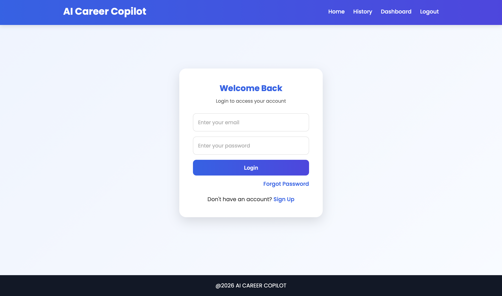
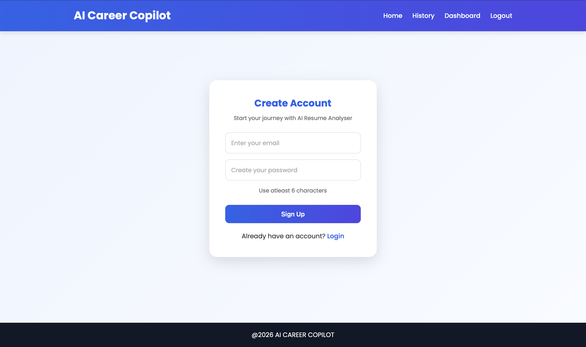
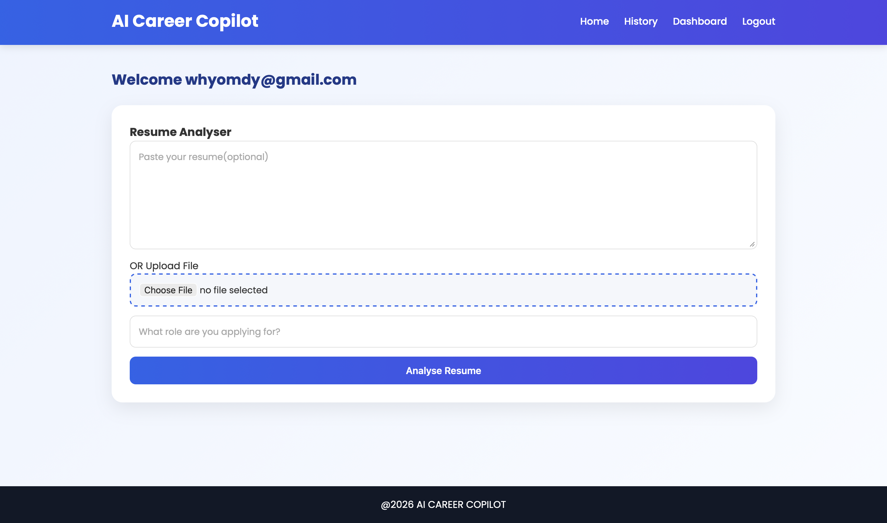
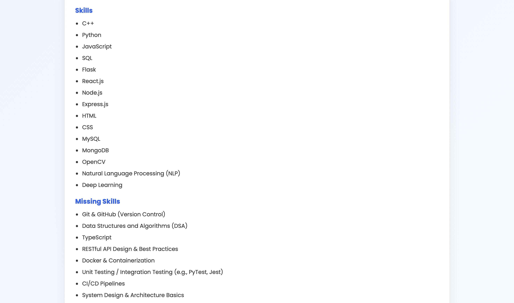
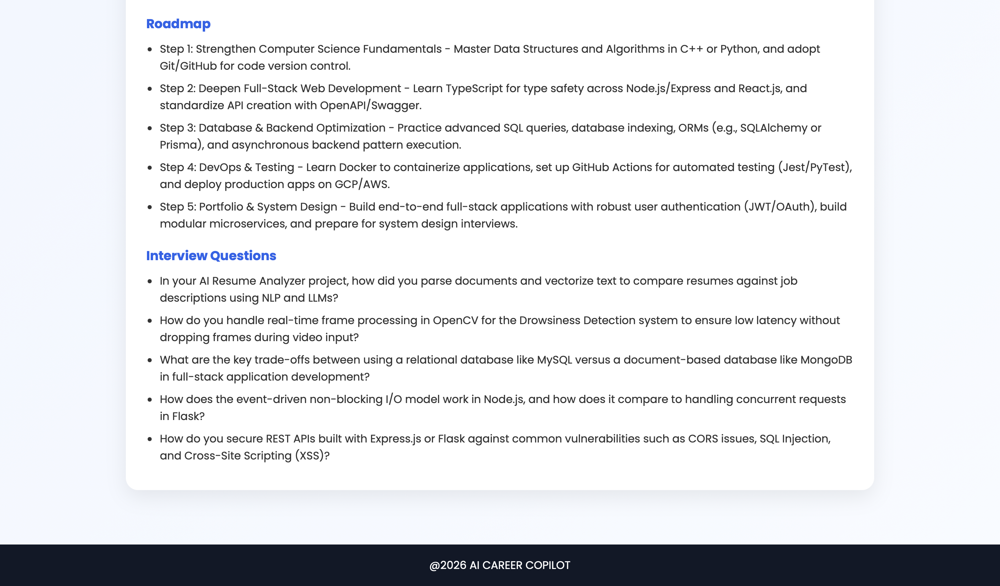
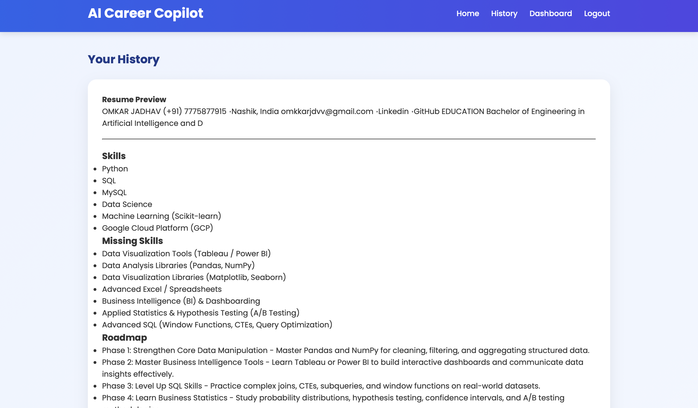

# 🚀 AI Career Copilot

AI Career Copilot is an AI-powered career assistant built using **Flask**, **Google Gemini AI**, and **MySQL (TiDB Cloud)**. The application helps users analyze their resumes based on their target job role and provides personalized career guidance, including relevant skills, missing skills, a learning roadmap, interview questions, and resume analysis history.

---

## 📌 Features

- 🔐 User Authentication (Signup & Login)
- 🔒 Secure Password Hashing
- 📄 Upload Resume (PDF/DOCX)
- 📝 Paste Resume Text
- 🤖 AI-Powered Resume Analysis using Google Gemini
- 🎯 Role-Based Resume Evaluation
- 💡 Missing Skills Identification
- 🗺️ Personalized Learning Roadmap
- ❓ Interview Question Suggestions
- 📚 Resume Analysis History
- 🔄 Forgot Password (Under Development)

---

## 🛠️ Tech Stack

### Frontend
- HTML5
- CSS3
- Jinja2 Templates

### Backend
- Python
- Flask
- SQLAlchemy

### Database
- MySQL (TiDB Cloud)

### AI
- Google Gemini API

### Libraries
- PyPDF2
- python-docx
- Flask-Mail
- python-dotenv
- Werkzeug
- SQLAlchemy

---

## 📂 Project Structure

```text
AI Career Copilot/
│
├── app.py
├── ai.py
├── db.py
├── models.py
├── requirements.txt
├── README.md
├── .gitignore
├── .env
│
├── static/
│   └── css/
│       └── style.css
│
├── templates/
│   ├── base.html
│   ├── login.html
│   ├── signup.html
│   ├── dashboard.html
│   ├── history.html
│   ├── forgot_password.html
│   └── reset_password.html
│
└── uploads/
```

---

## ⚙️ Installation

### 1. Clone the Repository

```bash
git clone https://github.com/your-username/AI-Career-Copilot.git

cd AI-Career-Copilot
```

### 2. Create a Virtual Environment

```bash
python -m venv venv
```

#### Windows

```bash
venv\Scripts\activate
```

#### macOS/Linux

```bash
source venv/bin/activate
```

### 3. Install Dependencies

```bash
pip install -r requirements.txt
```

### 4. Configure Environment Variables

Create a `.env` file in the project root.

```env
GEMINI_API_KEY=your_gemini_api_key

MAIL_USERNAME=your_email@gmail.com

MAIL_PASSWORD=your_gmail_app_password
```

### 5. Configure Database

Update the database connection string in `db.py`.

### 6. Run the Application

```bash
python app.py
```

Open your browser and visit:

```
http://127.0.0.1:5000
```

---

## 🚀 Workflow

```text
User Signup/Login
        │
        ▼
Upload Resume / Paste Resume
        │
        ▼
Resume Text Extraction
        │
        ▼
Google Gemini AI
        │
        ▼
AI Analysis
        │
        ├── Relevant Skills
        ├── Missing Skills
        ├── Learning Roadmap
        └── Interview Questions
        │
        ▼
Save Analysis to Database
        │
        ▼
View Analysis History
```

---

## 📸 Screenshots

### Login Page



---

### Signup Page



---

### Dashboard



---

### Resume Analysis




---

### History



---

## 🔮 Future Enhancements

- 📊 ATS Resume Score
- ✍️ Resume Improvement Suggestions
- 🎯 Resume Keyword Optimization
- 📄 Download Analysis Report as PDF
- 💼 AI-Based Job Recommendations
- 🤖 Career Chat Assistant
- 📈 Skill Progress Tracking
- 👨‍💼 Admin Dashboard
- 🌙 Dark Mode

---

## 👨‍💻 Author

**Omkar Jadhav**

Bachelor of Engineering (Artificial Intelligence & Data Science)

---

## 📜 License

This project is intended for educational and learning purposes.